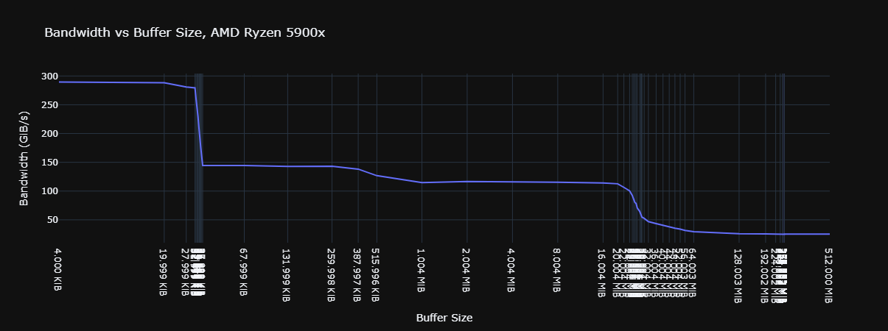

# Ryzen 9 5900X (Zen3)
Observed execution pipe capabilities:
- 3 mem read (2 for vmovdqu)
- 2 mem write

Agner Fog's [microarchitecture.pdf](https://www.agner.org/optimize/microarchitecture.pdf) writes:
> The Zen 3 can do three memory operations per clock cycle, with at most two memory writes, i.e. three reads, or two reads and one write, or one read and two writes.

Only reference for 2 load / cycle with 128 & 256 bit registers i could find is an [AMD Slide](https://images.anandtech.com/doci/16214/Zen3_arch_17.jpg), but it only mentions slowdown for 256b.

## cache-test


## read-unroll
```
Calibrating...
 3693 MHz
Read_x1
 Min: 823831270 (223.07ms), 1024.000MB @ 4.483GB/s, 0 page faults
 Max: 864773398 (234.16ms), 1024.000MB @ 4.271GB/s, 0 page faults
 Avg: 835174511 (226.14ms), 1024.000MB @ 4.422GB/s, 0 page faults
Read_x2
 Min: 414057787 (112.12ms), 1024.000MB @ 8.919GB/s, 0 page faults
 Max: 439268958 (118.94ms), 1024.000MB @ 8.407GB/s, 0 page faults
 Avg: 418791920 (113.40ms), 1024.000MB @ 8.819GB/s, 0 page faults
Read_x3
 Min: 276753154 (74.94ms), 1024.000MB @ 13.345GB/s, 0 page faults
 Max: 299212488 (81.02ms), 1024.000MB @ 12.343GB/s, 0 page faults
 Avg: 279271158 (75.62ms), 1024.000MB @ 13.224GB/s, 0 page faults
Read_x4
 Min: 277539035 (75.15ms), 1024.000MB @ 13.307GB/s, 0 page faults
 Max: 301044579 (81.51ms), 1024.000MB @ 12.268GB/s, 0 page faults
 Avg: 281265600 (76.16ms), 1024.000MB @ 13.130GB/s, 0 page faults
Read_x5
 Min: 277589873 (75.16ms), 1024.000MB @ 13.304GB/s, 0 page faults
 Max: 301119172 (81.53ms), 1024.000MB @ 12.265GB/s, 0 page faults
 Avg: 281420154 (76.20ms), 1024.000MB @ 13.123GB/s, 0 page faults
```

## write-unroll
```
Calibrating...
 3693 MHz
Write_x1
 Min: 827516507 (224.07ms), 1024.000MB @ 4.463GB/s, 0 page faults
 Max: 1097065059 (297.05ms), 1024.000MB @ 3.366GB/s, 0 page faults
 Avg: 847630286 (229.51ms), 1024.000MB @ 4.357GB/s, 0 page faults
Write_x2
 Min: 417983339 (113.18ms), 1024.000MB @ 8.836GB/s, 0 page faults
 Max: 446370812 (120.86ms), 1024.000MB @ 8.274GB/s, 0 page faults
 Avg: 424060731 (114.82ms), 1024.000MB @ 8.709GB/s, 0 page faults
Write_x3
 Min: 419044277 (113.47ms), 1024.000MB @ 8.813GB/s, 0 page faults
 Max: 441158289 (119.45ms), 1024.000MB @ 8.371GB/s, 0 page faults
 Avg: 422910913 (114.51ms), 1024.000MB @ 8.733GB/s, 0 page faults
Write_x4
 Min: 417710094 (113.10ms), 1024.000MB @ 8.841GB/s, 0 page faults
 Max: 488640055 (132.31ms), 1024.000MB @ 7.558GB/s, 0 page faults
 Avg: 422825597 (114.49ms), 1024.000MB @ 8.734GB/s, 0 page faults
Write_x5
 Min: 416269536 (112.71ms), 1024.000MB @ 8.872GB/s, 0 page faults
 Max: 442405411 (119.79ms), 1024.000MB @ 8.348GB/s, 0 page faults
 Avg: 422462900 (114.39ms), 1024.000MB @ 8.742GB/s, 0 page faults
```

## read-width
```
Calibrating...
 3693 MHz
Read_4x3
 Min: 69669705 (18.86ms), 1024.000MB @ 53.009GB/s, 0 page faults
 Max: 100911224 (27.32ms), 1024.000MB @ 36.598GB/s, 0 page faults
 Avg: 71537192 (19.37ms), 1024.000MB @ 51.626GB/s, 0 page faults
Read_8x3
 Min: 34733454 (9.40ms), 1024.000MB @ 106.328GB/s, 0 page faults
 Max: 54565639 (14.77ms), 1024.000MB @ 67.683GB/s, 0 page faults
 Avg: 35633646 (9.65ms), 1024.000MB @ 103.642GB/s, 0 page faults
Read_16x2
 Min: 25624905 (6.94ms), 1024.000MB @ 144.124GB/s, 0 page faults
 Max: 45205638 (12.24ms), 1024.000MB @ 81.697GB/s, 0 page faults
 Avg: 26200042 (7.09ms), 1024.000MB @ 140.960GB/s, 0 page faults
Read_16x3
 Min: 25942772 (7.02ms), 1024.000MB @ 142.358GB/s, 0 page faults
 Max: 45252776 (12.25ms), 1024.000MB @ 81.612GB/s, 0 page faults
 Avg: 26337957 (7.13ms), 1024.000MB @ 140.222GB/s, 0 page faults
Read_32x2
 Min: 12758525 (3.45ms), 1024.000MB @ 289.465GB/s, 0 page faults
 Max: 31929557 (8.65ms), 1024.000MB @ 115.666GB/s, 0 page faults
 Avg: 13129232 (3.56ms), 1024.000MB @ 281.292GB/s, 0 page faults
Read_32x3
 Min: 12796783 (3.47ms), 1024.000MB @ 288.600GB/s, 0 page faults
 Max: 32733197 (8.86ms), 1024.000MB @ 112.826GB/s, 0 page faults
 Avg: 13416611 (3.63ms), 1024.000MB @ 275.267GB/s, 0 page faults
```

## cache-test
```
Calibrating...
 3693 MHz
Read from 32KB buffer
 Min: 13164896 (3.56ms), 1024.000MB @ 280.527GB/s, 0 page faults
 Max: 14776319 (4.00ms), 1024.000MB @ 249.935GB/s, 0 page faults
 Avg: 13363121 (3.62ms), 1024.000MB @ 276.366GB/s, 0 page faults
Read from 64KB buffer
 Min: 26237810 (7.10ms), 1024.000MB @ 140.755GB/s, 0 page faults
 Max: 27174687 (7.36ms), 1024.000MB @ 135.903GB/s, 0 page faults
 Avg: 26443649 (7.16ms), 1024.000MB @ 139.660GB/s, 0 page faults
Read from 256KB buffer
 Min: 26106164 (7.07ms), 1024.000MB @ 141.465GB/s, 0 page faults
 Max: 28239071 (7.65ms), 1024.000MB @ 130.780GB/s, 0 page faults
 Avg: 26455500 (7.16ms), 1024.000MB @ 139.597GB/s, 0 page faults
Read from 512KB buffer
 Min: 27908730 (7.56ms), 1024.000MB @ 132.328GB/s, 0 page faults
 Max: 36267067 (9.82ms), 1024.000MB @ 101.831GB/s, 0 page faults
 Avg: 28523643 (7.72ms), 1024.000MB @ 129.476GB/s, 0 page faults
Read from 1024KB buffer
 Min: 31575763 (8.55ms), 1024.000MB @ 116.960GB/s, 0 page faults
 Max: 36719429 (9.94ms), 1024.000MB @ 100.577GB/s, 0 page faults
 Avg: 32411506 (8.78ms), 1024.000MB @ 113.945GB/s, 0 page faults
Read from 16384KB buffer
 Min: 31912981 (8.64ms), 1024.000MB @ 115.725GB/s, 0 page faults
 Max: 45114063 (12.22ms), 1024.000MB @ 81.862GB/s, 0 page faults
 Avg: 32829990 (8.89ms), 1024.000MB @ 112.492GB/s, 0 page faults
Read from 32768KB buffer
 Min: 73865690 (20.00ms), 1024.000MB @ 49.998GB/s, 0 page faults
 Max: 118180997 (32.00ms), 1024.000MB @ 31.250GB/s, 0 page faults
 Avg: 82821814 (22.43ms), 1024.000MB @ 44.591GB/s, 0 page faults
Read from 65536KB buffer
 Min: 108855517 (29.48ms), 1024.000MB @ 33.927GB/s, 0 page faults
 Max: 149652309 (40.52ms), 1024.000MB @ 24.678GB/s, 0 page faults
 Avg: 115372042 (31.24ms), 1024.000MB @ 32.010GB/s, 0 page faults
Read from 131072KB buffer
 Min: 132210213 (35.80ms), 1024.000MB @ 27.934GB/s, 0 page faults
 Max: 170775128 (46.24ms), 1024.000MB @ 21.626GB/s, 0 page faults
 Avg: 139851031 (37.87ms), 1024.000MB @ 26.407GB/s, 0 page faults
Read from 1048576KB buffer
 Min: 144117886 (39.02ms), 1024.000MB @ 25.626GB/s, 0 page faults
 Max: 167882764 (45.46ms), 1024.000MB @ 21.998GB/s, 0 page faults
 Avg: 146158358 (39.58ms), 1024.000MB @ 25.268GB/s, 0 page faults
```